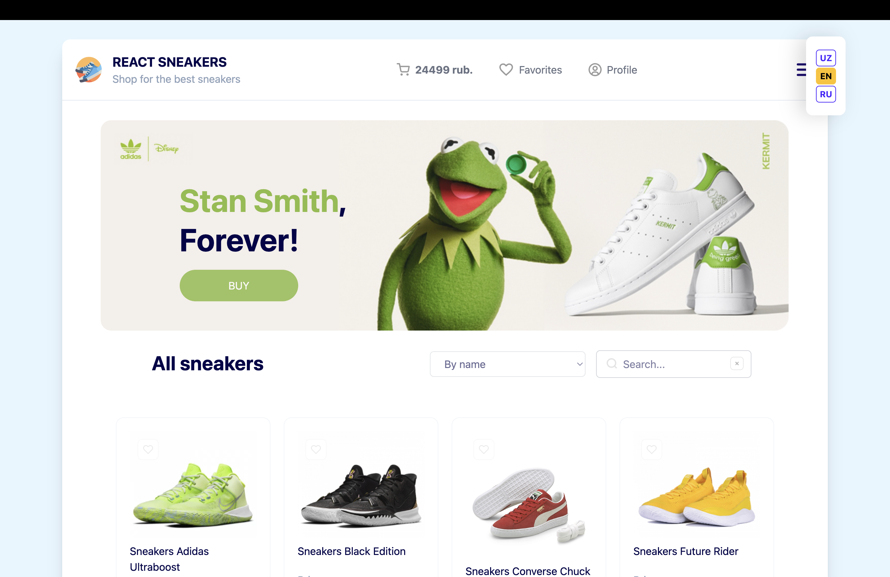
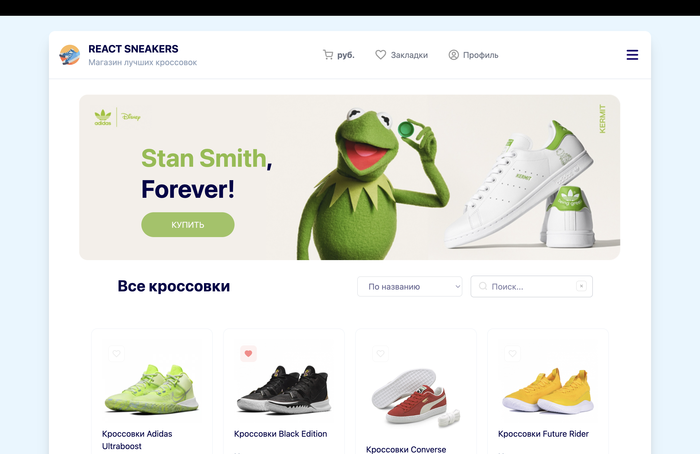

# 🛍️ React Sneaker Store

A responsive e-commerce application built with React and JavaScript.

This project was created as part of my frontend development portfolio to practice building a complete interactive shopping experience with product search, filtering, favorites, shopping cart, orders, theme switching, and multilingual support.

## 🚀 Live Demo

**Live Demo**: [Sneakers store URL](https://vue-sneakers-two-beryl.vercel.app/)

Repository: [GitHub repository URL](https://github.com/DaddySammyLabs/sneakers-shop-react)

## 📸 Preview




## ✨ Features

🛒 Add and remove products from the shopping cart
❤️ Add and remove products from favorites
📦 Create and manage orders
🔍 Search products by name
↕️ Sort products by name and price
🌙 Switch between light and dark themes
🌐 Multilingual interface
📱 Responsive layout for different screen sizes
⏳ Loading skeletons while products are loading
✨ Smooth list animations
🪟 Cart drawer and modal windows
⬆️ Smooth scrolling
🧩 Reusable React components

---

## 🛠️ Tech Stack

### ⚛️ Core

- **React**
- **JavaScript (ES6+)**
- **Vite**
- **React Router**

### 🎨 Styling

- **Tailwind CSS**
- **CSS Modules**
- **Global CSS**

### 🧠 State & Logic

- **React Hooks**
- **Context API**
- **Custom Hooks**

### 📦 Libraries

- **@formkit/auto-animate**

---

## 🧠 Architecture

The application is organized around reusable components and custom hooks.

The main goal was to keep UI components focused on presentation while moving reusable business logic into separate hooks.

```
User Interaction
        │
        ▼
    React Components
        │
        ▼
    Custom Hooks
        │
        ├── useCart
        ├── useFavorites
        ├── useOrders
        ├── useFilters
        ├── useTheme
        ├── useModal
        ├── useToggle
        └── useResize
        │
        ▼
Application State
        │
        ▼
        API
```

## Application State

useAppState.js acts as a central layer that combines different pieces of application logic.

Instead of keeping all logic inside App.jsx, functionality is divided between specialized hooks.

For example:

```
useAppState
├── useCart
├── useFavorites
├── useOrders
├── useFilters
├── useTheme
├── useModal
├── useResize
└── useLanguage
```

This makes individual features easier to maintain and reuse.

## 🪝 Custom Hooks

One of the main goals of the project was to practice creating reusable custom hooks.

### useCart

Responsible for shopping cart functionality:

Adding products
Removing products
Managing cart items
Opening and closing the cart drawer

### useFavorites

Handles the user's favorite products.

### useOrders

Responsible for order-related logic:

Creating orders
Managing order state
Completing orders
Removing orders

### useFilters

Handles catalog filtering:
Product search
Sorting by name
Sorting by price

### useTheme

Controls the application theme and allows users to switch between light and dark modes.

### useModal

Provides reusable modal state management.

### useToggle

A small reusable hook for boolean state values.

### useResize

Tracks the viewport size and allows the application to adjust its behavior for mobile devices.

## 🌐 Multilingual Support

The application supports multiple languages.

Text content is stored separately in:

src/constants/texts.js

Language-related functionality is located in the providers directory.

This approach keeps text content separated from UI components and makes adding additional languages easier.

## 🧭 Routing

The application uses React Router for client-side navigation.

Main routes include:

```
/ → Home / Product Catalog
/favorites → Favorite Products
/orders → User Orders
```

Navigation between pages happens without a full browser reload.

## 🛒 Shopping Experience

The application provides a complete basic shopping flow:

```
Browse Products
↓
Search / Sort
↓
Add to Cart
↓
Review Cart
↓
Create Order
↓
View Orders
```

Users can also save products to favorites and return to them later.

### 🔎 Search & Sorting

The product catalog supports dynamic search and sorting.

Available sorting options:

By name
Lowest price
Highest price

Search is performed based on the product title.

Filtering and sorting logic is isolated in the useFilters hook rather than being implemented directly inside the product components.

### ❤️ Favorites

Users can save products to a favorites list.

The favorites page reuses the same product card component as the main catalog, demonstrating component reusability across different pages.

### 📦 Orders

After adding products to the cart, users can create an order and access their order history.

The order-related logic is separated into useOrders and service.orders.js.

This structure makes the application easier to extend with a real backend in the future.

### ⏳ Loading States

Product loading is represented with skeleton components instead of leaving the page empty.

This improves the perceived loading experience and provides visual feedback while data is being retrieved.

### ✨ Animations

The project uses @formkit/auto-animate to create smooth transitions when the product list changes.

For example, animations are applied when products are filtered or sorted.

### 📱 Responsive Design

The interface is designed to work across different screen sizes.

The application uses:

Responsive Tailwind CSS utilities
CSS Modules
A custom useResize hook
Adaptive component behavior

The goal was to keep the main shopping experience usable on both desktop and mobile devices.

## 📁 Project Structure

```
src/
├── api/
│ ├── service.items.js
│ └── service.orders.js
│
├── assets/
│ ├── icons/
│ ├── images/
│ └── styles/
│ └── global.css
│
├── constants/
│ └── texts.js
│
├── context/
│ └── ...
│
├── hooks/
│ ├── useCart.js
│ ├── useFavorites.js
│ ├── useModal.js
│ ├── useTheme.js
│ ├── useToggle.js
│ └── ...
│
├── providers/
│ ├── LanguageSwitcher.css
│ ├── LanguageSwitcher.jsx
│ └── useLanguage.js
│
├── App.jsx
├── App.module.css
├── main.jsx
└── useAppState.js

public/
├── icons/
└── images/
└── sneakers/
```

## 🔌 API Layer

API-related functionality is separated from the UI.

src/api/
├── service.items.js
└── service.orders.js

service.items.js is responsible for retrieving product data, while service.orders.js contains order-related operations.

Keeping API logic separate makes it easier to replace mock/local data with a real backend API later.

## 🎯 What I Practiced

This project helped me practice several important frontend concepts:

Building reusable React components
Creating and composing custom hooks
Managing complex application state
Using React Context
Working with React Router
Separating business logic from UI
Handling asynchronous data
Implementing search and sorting
Creating reusable modal and toggle logic
Working with responsive layouts
Managing light/dark themes
Implementing multilingual UI
Creating loading states
Adding UI animations
Structuring a React project for scalability

### 🔮 Future Improvements

The project can be extended with several features:

🔐 User authentication
💾 Persistent cart and favorites
🗄️ Real backend and database
📄 Individual product pages
🛍️ Checkout page
💳 Payment integration
📍 Order delivery information
🧪 Unit and integration tests
🟦 TypeScript migration
♿ Improved accessibility
📄 Pagination or infinite scrolling
🔔 Toast notifications
🧾 More detailed order history

### 💻 Installation

Clone the repository:

git clone https://github.com/your-username/react-sneaker-store.git

Navigate to the project:

`cd react-sneaker-store`

Install dependencies:

`npm install`

Start the development server:

`npm run dev`

Build the project for production:

`npm run build`

## 👨‍💻 About

This project is part of my frontend development portfolio.

I built it to gain practical experience with React architecture, state management, custom hooks, routing, reusable components, and interactive UI development.

The main focus was not only on making the interface work, but also on learning how to organize application logic into independent and reusable parts.
